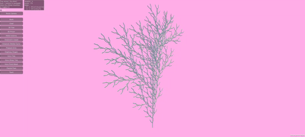
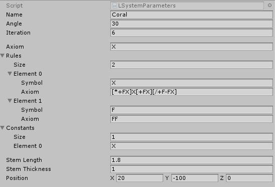
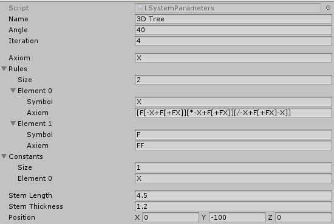

# L-System Generator

Procedural plant and fractal generator:  
Create, visualize, and experiment with L-Systems in 3D.

- [Experiment](https://lombardidelavega.itch.io/l-system)
- [Learn more about L-Systems](https://en.wikipedia.org/wiki/L-system)

  

This project was created in 2018, and I recently made a quick update to migrate it from GitLab to GitHub, recompiling it, adding a README, and publishing it on [itch.io](https://lombardidelavega.itch.io/l-system).

## Key Features

- **Scriptable Models**: All L-System models are stored as ScriptableObjects for easy sharing and modification.
- **Flexible Rendering**: Switch between line renderer (lightweight) and mesh construction (3D) or other custom renderers (extensible).
- **Toolbox**: Experiment with different formulas and see the results instantly.

## Potential Improvements
The mesh generation algorithm is quite basic and could be enhanced in different ways:
- Quality-focused: Better branch junctions, smoother branches
- Performance-focused: Fewer vertices, optimized meshes
- Or create a fun particle-based renderer, shaders, or any other creative approach instead of meshes and lines

## Examples

### Coral
  

### Tree
  

